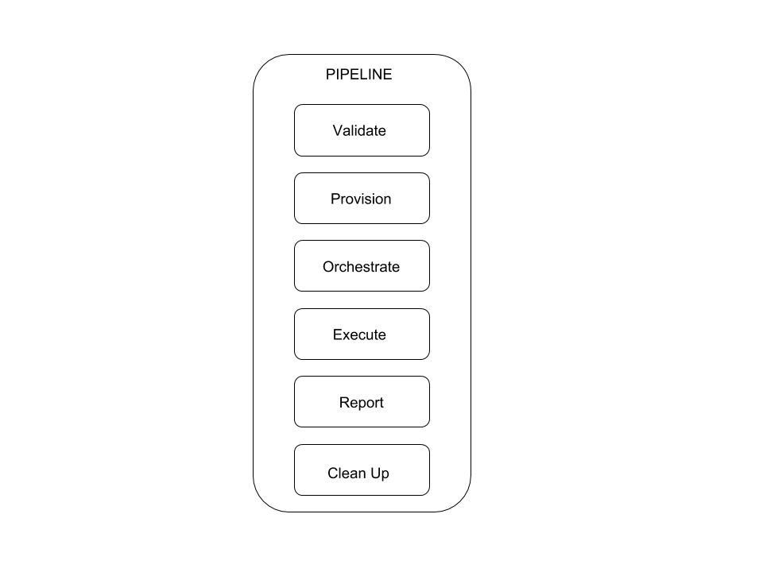

Architecture
============

This page is intended to explain the architecture behind teflo. We strongly
recommend that you review the `scenario descriptor
<../users/scenario_descriptor.html>`_ since it will be helpful when following
this document.

Basics
------

Lets first start with the basics. Teflo is driven by an input file
(scenario descriptor). This input file defines the E2E scenario to be
processed. Within the file, there are multiple task definitions defined. Each
task definition contains resources. These resources will be executed against
that given task.

Each teflo execution creates a teflo object for the E2E scenario.
The teflo object further creates resource objects for each of the
resources provided in the scenario descriptor file. These resources
have tasks associated to them to be executed.

Teflo Object
-------------

As we just learned from the `basics <architecture.html#basics>`_ section,
the teflo object contains resources. The core resource which makes up the
teflo object is a scenario resource. A scenario resource consists of multiple
objects of 'resources' which derive tasks for the scenario to be processed.
Each resource has a list of associated tasks to it. When teflo executes these
tasks the resources associated to that task are used.

Lets see a diagram with the available resources for a teflo object. The teflo
object is made up of scenario resource and the scenario resource comprises of
other resources(asset, action, execute, report, notification).

.. image:: ../_static/teflo_scenario_resource.png

The diagram above shows the resources that make up a scenario resource. The table
below describes each resource in more detail.

.. list-table::
    :widths: auto
    :header-rows: 1

    *   - Resource
        - Description

    *   - Scenario
        - The core resource which makes up the teflo compound. The scenario
          resource holds the other resources(asset, action, execute and report)

    *   - Asset
        - The asset resources define the system resources for the scenario.
          These can be anything from hosts, virtual networks, storage,
          security keys, etc.

    *   - Action
        - The action resources define the actions to be performed against
          the defined hosts for the scenario. These actions consist of:
          system configuration, product installation, product configuration,
          framework installation and framework configuration. In summary this
          resource provides the scenario with the ability to perform any
          remote actions against the hosts defined.

    *   - Execute
        - The execute resources define the tests to be executed against the
          defined host resources.

    *   - Report
        - The report resources defines which reporting and analysis system to
          import test artifacts generated during the execution phase.

    *   - Notification
        - The notification resources defines which tool to send the notification
          to based on the triggers

Now that we have knowledge about how a teflo object is constructed. Which
includes a number of resources. Lets dive deeper into the resources. What do
we mean by this? Every resource has a number of tasks that it can correspond
to.

.. image:: ../_static/teflo_scenario_resource_task.png

The diagram above shows the teflo object with resources defined. Each of
those resources then have a list of tasks associated to it. This means that
when teflo runs a scenario, for each task to be processed it will run the
given resources associated to that given task.

e.g. The scenario resource has validate task. This means that when teflo runs
the validate task it will process the scenario resource.

e.g. The asset resource has a validate, provision and clean up task. This means
that when teflo runs the validate task it will process that asset resource.
When it goes to the provision task, it will process that asset resource and
the same for clean up task.

e.g. The action resource has a validate and orchestrate task. This means that
when teflo runs the validate task it will process that action resource. When
it goes to the orchestrate task, it will process that action resource.

This same logic goes for the execute and report resources.

Teflo Pipeline
---------------

In the previous section about `teflo object <architecture.html#teflo-object>`_
we learned about how a teflo object is constructed with resources and tasks.
Every resource could have different tasks. Those tasks are executed in a
certain order which the user can provide.

Lets see a diagram showing the default tasks that will get executed
when running teflo.

The above diagram shows the ordered list from top to bottom of the tasks
teflo will execute.

If no resources are associated to a given task, teflo would skip executing
the task. This provides the user with the ability to control the flow of
their scenario.

Plug And Play
-------------

Teflo was developed with the OO programming model which allows it to be
easily extended. This means teflo is very flexible at being able to
interface with various applications. Teflo supports a plugin model where
it can interface with different plugins created for teflo. Teflo has interfaces
for provisioners, orchestartors, executors, importers and notifiers. These interfaces
allow differnt plugins to work with teflo.

The best way to explain this is to go through a couple examples.
First we will look at how this relates to asset resources and the provision task.

Every asset resource defined within a teflo object has an associated provisioner
to it. This allows the user to select different tools to handle the provision task request.
Teflo provides an asset_provisioner interface which can talk to differnt provisioners, e.g.
bkr_client_plugin, os_libcloud_plugin, etc.

.. code-block:: bash

    teflo/provisioners
    ├── asset_provisioner.py
    ├── ext
    │   ├── bkr_client_plugin
    │   │   ├── beaker_client_plugin.py
    │   │   ├── __init__.py
    │   │   └── schema.yml
    │   ├── __init__.py
    │   └── os_libcloud_plugin
    │       ├── __init__.py
    │       ├── openstack_libcloud_plugin.py
    │       └── schema.yml
    ├── __init__.py

.. code-block:: yaml

    ---
    name: demo
    description: demo

    provision:
      - name: ccit_ci_test_client_a
        groups: client, test_driver
        provisioner: openstack_libcloud
        credential: openstack
        key_pair: ccit_key
        image: rhel-7.4-secommonrver-x86_64-released
        flavor: m1.small
        network:
         - private_network
         - provider_net_cci_8
        ansible_params:
          ansible_user: cloud-user
          ansible_ssh_private_key_file: keys/ccit_key

The above code snippets demonstrate how from the asset resource definition
defined within the scenario descriptor file. It tells teflo that it would like
it to use the openstack_libcloud provisioner. With this flexibility users could
provide their own module to provision and define this as the provisioner for
their given asset resource.

Teflo uses bkr_client_plugin(using beaker client) and os_libcloud_plugin (using openstack libcloud) as its native
provisioner plugins. The implementation for users to plug in their own provisioner can be possible by
creating a separate provisoner plugin. We currently have  external provisioner plugins for linchpin
and openstack-client

Here is an example based on a custom provisioner module:

.. code-block:: bash

    teflo/provisioners
    ├── beaker.py
    ├── ext
    │   └── __init__.py
    ├── __init__.py
    ├── openshift.py
    ├── openstack.py
    └── provisioner_xyz.py

.. code-block:: yaml

    ---
    name: demo
    description: demo

    provision:
        - name: machine1
          provisioner: provisioner_xyz        # provisioner name
          credential: openstack-creds
          image: image1
          flavor: flavor
          networks:
            - network
          floating_ip_pool: 0.0.0.0
          keypair: keypair
          groups: group1

.. note::

   Please visit `Developers Guide <./development.html#wip-how-to-write-an-plugin-for-teflo>`__ to understand more about how to create a customized plugin for Teflo

Plugin model also applies to the other resources within the teflo object. Lets look
at the action resource. Teflo provides a orchestrator interface
called action_orchestrator which will interface with different orchestrator plugins.
This resources main purpose is to perform configuration actions. To do configuration
there are a lot of tools that currently exists to perform these actions.
By default teflo supports the ansible orchestrator plugin out of the box.
It can easily be plugged in to use a different orchestrator.

Here is an example with an action resource using the default ansible
orchestrator by teflo.

.. code-block:: bash

    teflo/orchestrators/
    ├── _ansible.py
    ├── _chef.py
    ├── ext
    │   └── __init__.py
    ├── __init__.py
    └── _puppet.py

.. code-block:: yaml

    ---
    name: demo
    description: demo

    provision:
      - name: ccit_ci_test_client_a
        groups: client, test_driver
        provisioner: openstack_libcloud
        credential: openstack
        key_pair: ccit_key
        image: rhel-7.4-secommonrver-x86_64-released
        flavor: m1.small
        network:
         - private_network
         - provider_net_cci_8
        ansible_params:
          ansible_user: cloud-user
          ansible_ssh_private_key_file: keys/ccit_key

    orchestrate:
        - name: rhn_subscribe
          orchestrator: ansible         # orchestrator name
          hosts:
            - machine1
          vars:
            rhn_hostname: <hostname>
            rhn_user: <user>
            rhn_password: <password>

It can easily be extended to work with other various orchestrators.

Conclusion
----------

Hopefully after reading this document you were able to have a better
understanding on how teflo was designed. To gain an even deeper understanding
on how it works. We highly recommend following the `development <development.html>`_
document to step through the code.
