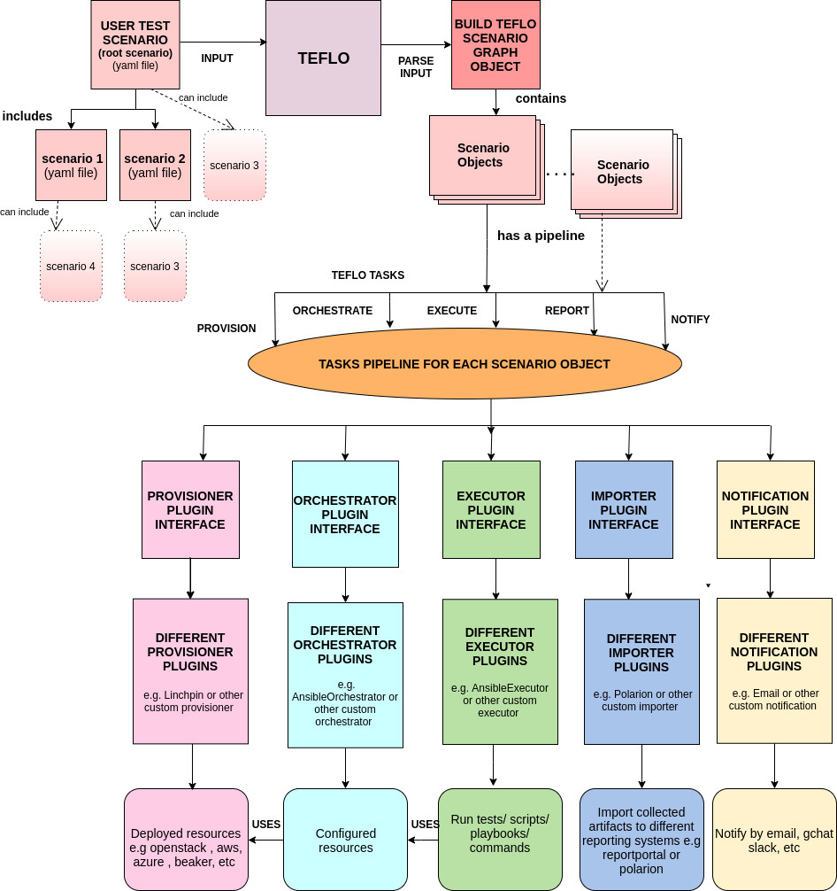

Welcome to Teflo!
==================

What is Teflo?
---------------

**TEFLO** stands for (**T** est **E** xecution **F** ramework **L** ibraries and **O** bjects)

Teflo is an orchestration software that controls the flow of a set of testing scenarios.
It is a standalone tool that includes all aspects of the workflow.
It allows users to provision machines, deploy software, execute tests against them and
manage generated artifacts and report results.

Teflo Provides *structure*, *readability*, *extensibility* and *flexibility* by :

- providing a DSL (YAML) to express a test workflow as a series of steps.
- enabling integration of external tooling to execute the test workflow as defined by the steps.

Teflo can be used for an E2E (end to end) multi-product scenario. Teflo handles coordinating the
E2E task workflow to drive the scenario execution.

What does an E2E workflow consist of?
-------------------------------------

At a high level teflo executes the following tasks when processing a scenario.

   - Provision system resources
   - Perform system configuration
   - Install products
   - Configure products
   - Install test frameworks
   - Configure test frameworks
   - Execute tests
   - Report results
   - Destroy system resources
   - Send Notifications

Teflo is a test execution framework. It is a standalone tool written in Python.
Teflo can perform the following tasks

**Provision** - Create resources they want to test on (physical resources, VMs etc)

**Orchestrate** - Configure these resources , like install packages on them, run scripts, ansible playbooks etc

**Execute** - Execute actual tests on the configured resources

**Report** - Send or collect logs from the run tests

**Notification** - Send email/gchat/slack notification during each stage of teflo run or at the end based on the triggers set

**Cleanup** - Cleanup all the deployed resources.

These tasks can be run individually or together.

Teflo follows a pluggable architechture, where users can add different pluggins to support external tools
Below is a diagram that gives you a quick overview of Teflo workflow

* To learn more about how to set up and use Teflo please check out the `Users Guide <users/quickstart.html>`__
* To know how to create a custom plugin checkout `Developers Guide <developers/development.html#how-to-write-an-plugin-for-teflo>`__
* To know about our release cadence and contribution policy check out `Release Cadence <developers/development.html#release-cadence>`__

.. include:: contents.rst.inc
